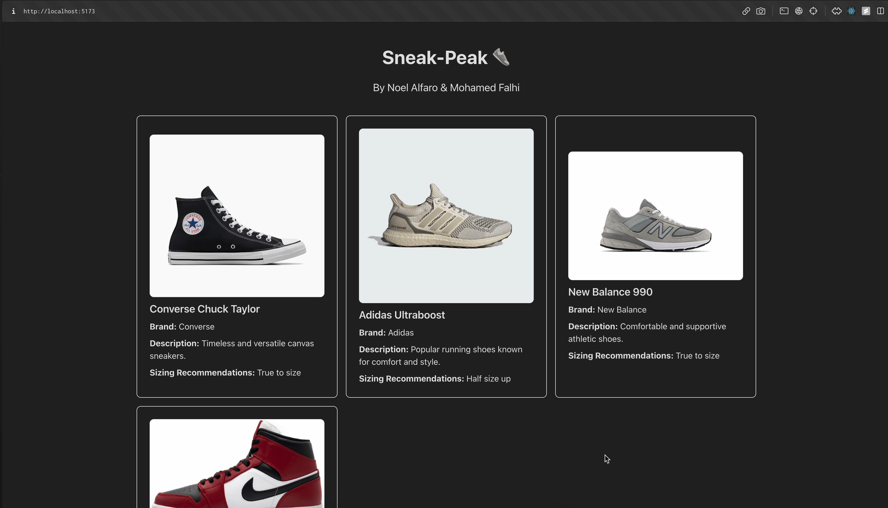

# Sneak-Peak

CodePath WEB103 Final Project

Designed and developed by: Noel Alfaro & Mohamed Reda Falh

🔗 Link to deployed app: https://sneak-peak-client.up.railway.app/dashboard

## Table of Contents

- [Backend and Frontend Configuration](#baseline-features)
- [Backend Features](#backend-features)
- [Frontend Features](#frontend-features)
- [Getting Started](#getting-started)
- [Contributing](#contributing)

## About

### Description and Purpose

Sneak-Peak is a web application designed to cater to sneaker enthusiasts, and newcomers.
It is a web app built with Node.js/Express and PostgresSQL on the backend and React on the frontend.
The purpose of this app is to allow users to be able to manage, share & showcase their shoe collections.

### Inspiration

We were inspired by shoe buying apps like GOAT, which allow users to buy new and vintage shoes.
We wanted to create an app that users can treat as their digital locker room to store & update their collections, upvote other users shoes, and highlight their favorites.

## Tech Stack

Frontend: React, Tailwind CSS

Backend: Node, Express, PostgresSQL database

## Baseline Features

- Built using an Express backend and a React frontend.
- Dynamic routes implemented for both frontend and backend.
- Hosted and deployed via Railway.

## Gifs showcasing work done so far:

### Logging in, Viewing all shoes, specific shoe, user profile, editing, and logging out

### Adding & Deleting a Shoe

## Backend Features

### Database Relationships in Postgres

**User & Sneaker**: One-to-many relationship where each user can upload multiple shoes.
**User & Sneaker**: Many-to-many relationship where many users can upvote/downvote multiple shoes.
**User & Profile**: One-to-One relationship is established between users and their profiles. Users can customize their profiles to add additional information, enhancing their personalization within the app.

<!-- 2. **User & SneakPeak Comments**: Many-to-many relationship with a join table to facilitate user comments on Sneak-Peak. -->

### RESTful API Endpoints

- **GET** `/shoes`: Fetch all shoe collections.
- **POST** `/shoes`: Add a new shoe to a user's collection.
- **PATCH** `/edit/shoes/:id`: Update shoe details.
- **DELETE** `edit/shoes/:id`: Remove a shoe from the collection.

### Database Management

API endpoint to reset the database to its initial state.

## Frontend Features

### View Uploaded Shoes ✅

While on the dashboard, the user can view cards of the shoes already uploaded to the database

### Uploading a Shoe ✅

The user should be able to fill out a form to upload a new 'Shoe' to add to their collection

### Redirection ✅

After creating a Shoe, users are navigated to the Sneak-Peak gallery.

### User can Edit/Delete shoe from their collection ✅

Users can edit or delete shoes listed in their collection

### User log in via Github ✅

The user can log in via Github

  

## Getting Started

1. Clone the repository.
2. Install dependencies using `npm install`.
3. Start the server using `npm start`.
4. Navigate to `localhost:3000` to see the app in action.
